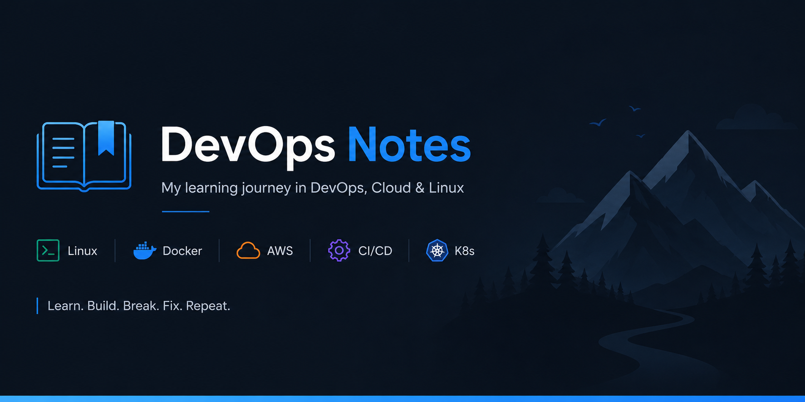

```md
# DevOps Handbook

<p align="center">
  
</p>

<p align="center">
  
  
  
  
</p>

<p align="center">
A structured collection of DevOps notes, practical examples, commands, configurations, and real-world learning resources.
</p>

---

## 📖 About

This repository is a centralized knowledge base documenting my DevOps learning journey through hands-on practice, official documentation, and real-world projects.

Rather than collecting isolated commands, these notes focus on understanding concepts, implementing them in practical scenarios, troubleshooting common issues, and documenting the lessons learned.

The repository is continuously updated as I explore new technologies and production workflows.

---

# 📚 Topics

- Linux
- Git & GitHub
- Docker
- Networking
- Nginx
- CI/CD
- AWS
- Kubernetes
- Terraform
- Monitoring
- Security
- Production Best Practices

---

# 📂 Repository Structure

```

.
├── Linux/
├── Git/
├── Docker/
├── Networking/
├── Nginx/
├── AWS/
├── Kubernetes/
├── Terraform/
├── Monitoring/
├── Security/
└── README.md

```

Each section includes:

- 📘 Concept explanations
- 💻 Commands and examples
- ⚙️ Configuration files
- 🛠️ Hands-on exercises
- 🐞 Troubleshooting guides
- 📌 Best practices
- 🌍 Real-world use cases

---

# 🎯 Learning Methodology

Every topic follows a structured workflow:

```

Concept
│
▼
Official Documentation
│
▼
Hands-on Practice
│
▼
Mini Project
│
▼
Break Things Intentionally
│
▼
Troubleshoot & Fix
│
▼
Document Learnings
│
▼
Teach Yourself

```

The objective is to understand **how**, **why**, and **when** technologies are used instead of simply memorizing commands.

---

# 🚀 Purpose

This repository serves as:

- 📖 Personal DevOps knowledge base
- 🔍 Interview preparation resource
- ⚡ Quick command reference
- 🧩 Troubleshooting guide
- 📚 Documentation of practical learning
- 🏗️ Reference for future projects

---

# 📌 Current Focus

The repository is actively expanding with content covering:

- Cloud Computing (AWS)
- Containerization
- Infrastructure as Code
- Kubernetes
- CI/CD Pipelines
- Monitoring & Observability
- DevOps Best Practices

---

# 🤝 Contributions

Suggestions, corrections, and improvements are welcome.

If you find any mistakes or have ideas to improve these notes, feel free to open an Issue or submit a Pull Request.

---

# ⭐ Support

If you find this repository helpful, consider giving it a ⭐.

It helps others discover the project and motivates continued improvements.

---

> **Learning by building. Understanding by breaking. Growing by documenting.**
```
