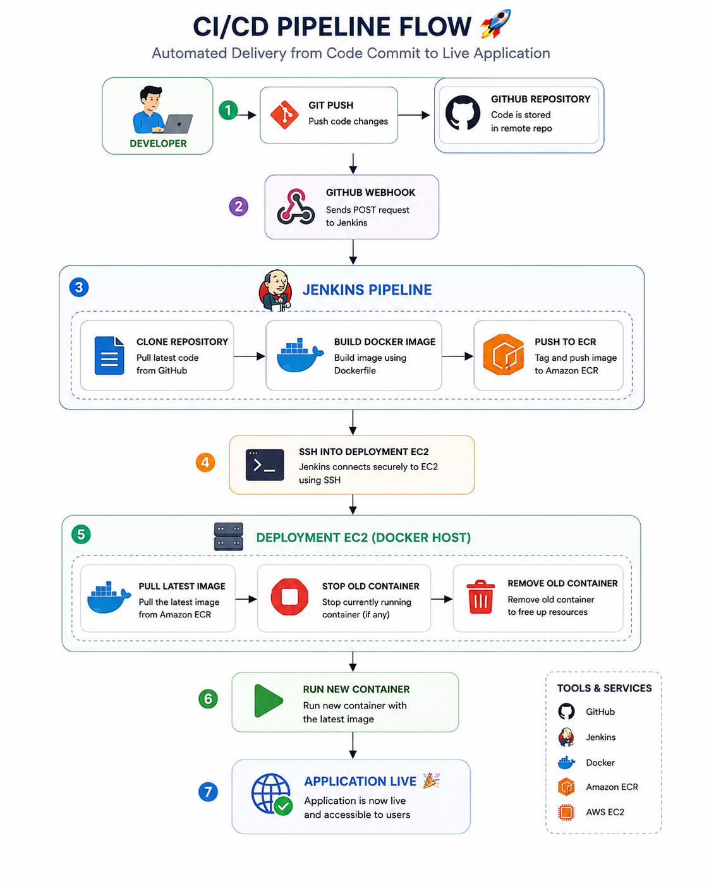

# CI/CD Pipeline: GitHub → Jenkins → Docker → Amazon ECR → AWS EC2

An automated, production-style CI/CD pipeline that builds a Docker image once and deploys it consistently across environments — following the **"Build Once, Deploy Anywhere"** principle.

Every push to the main branch triggers Jenkins to build, test, containerize, and ship the application to AWS — with zero manual intervention.

---

## Table of Contents

- [Overview](#overview)# 🚀 CI/CD Pipeline using GitHub, Jenkins, Docker, Amazon ECR & AWS EC2

> **Automated CI/CD pipeline implementing the Build Once, Deploy Anywhere principle using Docker, Jenkins, Amazon ECR, and AWS EC2.**

---

## 📖 Overview

This project demonstrates a complete production-style **Continuous Integration and Continuous Deployment (CI/CD)** pipeline.

The pipeline automatically builds, packages, stores, and deploys a Dockerized application whenever new code is pushed to GitHub.

Instead of building the application directly on the production server, Jenkins builds the Docker image once, publishes it to **Amazon Elastic Container Registry (ECR)**, and the deployment server pulls the latest tested image from ECR.

This architecture improves deployment reliability, scalability, security, and consistency while following industry best practices.

---

# 🏗️ Architecture

> Replace the image path below with your repository image path.

```md

```

---

# 🔄 Complete Workflow

```text
Developer
     │
     ▼
Git Push
     │
     ▼
GitHub Repository
     │
     ▼
GitHub Webhook
     │
     ▼
Jenkins Pipeline
     │
     ├── Clone Repository
     ├── Build Docker Image
     ├── Authenticate with Amazon ECR
     ├── Push Docker Image to Amazon ECR
     └── SSH into Deployment EC2
                     │
                     ▼
Deployment EC2
     ├── Authenticate with Amazon ECR
     ├── Pull Latest Docker Image
     ├── Stop Old Container
     ├── Remove Old Container
     └── Run New Container
                     │
                     ▼
            🚀 Application Live
```

---

# 🎯 Project Objective

The objective of this project is to automate the software deployment lifecycle.

Instead of manually deploying code to a production server, the entire process is automated through Jenkins.

Every code push automatically:

- Builds the application
- Creates a Docker image
- Pushes the image to Amazon ECR
- Deploys the latest version to the production server

This eliminates manual deployment, reduces errors, and ensures consistent deployments.

---

# 🛠️ Technologies Used

| Technology | Purpose |
|------------|---------|
| Git | Version Control |
| GitHub | Source Code Repository |
| GitHub Webhook | Automatically triggers Jenkins |
| Jenkins | CI/CD Automation Server |
| Docker | Containerization |
| Dockerfile | Docker Image Build Instructions |
| Amazon ECR | Private Docker Image Registry |
| Amazon EC2 | Deployment Server |
| AWS IAM | Secure Authentication & Authorization |
| AWS CLI | AWS Service Communication |
| SSH | Secure Remote Deployment |
| Ubuntu Linux | Server Operating System |

---

# ⚙️ Pipeline Execution

## 1. Developer Pushes Code

The developer commits and pushes code to the private GitHub repository.

```bash
git add .
git commit -m "Update application"
git push origin main
```

---

## 2. GitHub Webhook

GitHub automatically sends a webhook event to Jenkins whenever new code is pushed.

No manual build trigger is required.

---

## 3. Jenkins Pipeline

Jenkins receives the webhook and starts the pipeline.

Pipeline stages include:

- Clone Repository
- Build Docker Image
- Authenticate with AWS
- Push Image to Amazon ECR
- Deploy to EC2

---

## 4. Docker Build

Jenkins builds a Docker image using the Dockerfile.

The image contains:

- Application Code
- Runtime Environment
- Dependencies
- Configuration

This ensures identical execution across environments.

---

## 5. Authentication with Amazon ECR

Jenkins authenticates using an IAM Role (or IAM credentials).

AWS returns a temporary authorization token.

Docker uses this token to securely log in to Amazon ECR.

---

## 6. Push Docker Image

The newly built Docker image is tagged and pushed to Amazon ECR.

Example:

```
project:v1
project:v2
project:latest
```

---

## 7. Deployment

Jenkins connects to the deployment EC2 instance through SSH.

Deployment server:

- Authenticates with Amazon ECR
- Pulls latest Docker image
- Stops old container
- Removes old container
- Starts new container

Application becomes live.

---

# 📦 Why Amazon ECR?

Amazon ECR acts as the centralized Docker image registry.

Instead of building Docker images directly on the production server, Jenkins builds the image once and stores it in ECR.

Deployment servers simply download the already-tested image.

Benefits include:

- Centralized Docker image storage
- Build once, deploy anywhere
- Easy image versioning
- Simplified rollback
- Secure IAM authentication
- Better scalability
- Native AWS integration

---

# 🖥️ Why Amazon EC2?

Amazon EC2 provides the compute environment where the application runs.

Its responsibility is only to:

- Pull Docker images
- Run containers
- Serve application traffic

The production server never builds application code.

This reduces CPU usage and improves deployment reliability.

---

# 🔒 Security

The project follows AWS security best practices.

- Private GitHub Repository
- IAM-based authentication
- Temporary ECR authorization tokens
- SSH-based deployment
- Private Docker image registry
- No hardcoded AWS credentials

---

# 📂 Project Structure

```
.
├── Dockerfile
├── Jenkinsfile
├── package.json
├── src/
├── images/
│   └── ci-cd-pipeline.png
└── README.md
```

---

# ✨ Features

- Automated CI/CD Pipeline
- Dockerized Application
- GitHub Webhook Integration
- Jenkins Automation
- Amazon ECR Integration
- Secure IAM Authentication
- Automatic Deployment
- Docker Image Versioning
- Easy Rollback
- Production-Ready Workflow

---

# 🚀 Key Benefits

✅ Fully automated deployment

✅ Zero manual deployment

✅ Build Once, Deploy Anywhere

✅ Faster deployments

✅ Reduced production server load

✅ Consistent deployments

✅ Version-controlled Docker images

✅ Simplified rollback

✅ Production-ready architecture

---

# 💡 Traditional Deployment vs CI/CD

## Traditional Deployment

```
Developer

↓

SSH into Server

↓

git pull

↓

docker build

↓

docker run
```

### Problems

- Manual deployment
- High CPU usage
- Slow deployments
- Build on production server
- Difficult rollback
- Higher risk of deployment failures

---

## CI/CD Deployment (This Project)

```
Developer

↓

GitHub

↓

Jenkins

↓

Docker Build

↓

Amazon ECR

↓

Deployment EC2

↓

Application Live
```

### Advantages

- Automated deployment
- Build only once
- Production server only runs tested images
- Faster deployments
- Better scalability
- Easy rollback
- Consistent deployments

---

# 🧠 What I Learned

Through this project, I gained hands-on experience with:

- Git & GitHub
- Jenkins Pipelines
- Docker
- Dockerfile
- Amazon EC2
- Amazon ECR
- AWS IAM
- AWS CLI
- SSH Automation
- Production Deployment Strategies
- CI/CD Best Practices
- Troubleshooting Deployment Issues

---

# 📌 Key Takeaways

- Jenkins is responsible for building Docker images.
- Amazon ECR stores Docker images securely.
- EC2 retrieves and runs Docker containers.
- Production servers should never build application code.
- Docker images provide consistent deployments.
- Separating build and deployment environments improves reliability and scalability.

---

# 🏆 Outcome

Successfully implemented a production-style CI/CD pipeline that automatically:

- Builds Docker images
- Stores images securely in Amazon ECR
- Deploys the latest version to Amazon EC2
- Keeps deployments reliable, repeatable, and scalable

---

## ⭐ If you found this project helpful, consider giving it a Star!
- [Architecture](#architecture)
- [How It Works](#how-it-works)
- [Tech Stack](#tech-stack)
- [Pipeline Stages in Detail](#pipeline-stages-in-detail)
- [Why Amazon ECR?](#why-amazon-ecr)
- [Why Amazon EC2?](#why-amazon-ec2)
- [Security](#security)
- [Project Structure](#project-structure)
- [Traditional Deployment vs. This Pipeline](#traditional-deployment-vs-this-pipeline)
- [Key Takeaways](#key-takeaways)
- [What I Learned](#what-i-learned)
- [Outcome](#outcome)

---

## Overview

Manually deploying code — SSHing into a server, pulling the latest changes, and rebuilding the app on the spot — is slow, error-prone, and hard to reproduce. This project solves that problem.

Instead of building the application directly on the production server, **Jenkins builds the Docker image exactly once** and publishes it to **Amazon Elastic Container Registry (ECR)**. The deployment server then simply pulls that pre-built, already-tested image and runs it.

The result is a pipeline that is faster, safer, and far easier to roll back than a traditional deploy-by-hand workflow.

---

## Architecture

> Replace the path below with the actual image location in your repository.


---

## How It Works

```
Developer
   │  git push
   ▼
GitHub Repository
   │  webhook trigger
   ▼
Jenkins Pipeline
   ├─ Clone repository
   ├─ Build Docker image
   ├─ Authenticate with Amazon ECR
   ├─ Push image to Amazon ECR
   └─ SSH into deployment EC2 instance
          │
          ▼
   Deployment EC2 Instance
   ├─ Authenticate with Amazon ECR
   ├─ Pull latest Docker image
   ├─ Stop old container
   ├─ Remove old container
   └─ Start new container
          │
          ▼
   Application is live 🚀
```

**In short:** a code push is all it takes. GitHub notifies Jenkins, Jenkins builds and ships the image, and EC2 just runs it.

---

## Tech Stack

| Technology | Role in the Pipeline |
|---|---|
| Git | Version control |
| GitHub | Source code repository |
| GitHub Webhooks | Automatically triggers Jenkins on push |
| Jenkins | CI/CD automation server |
| Docker | Application containerization |
| Amazon ECR | Private Docker image registry |
| Amazon EC2 | Deployment / production server |
| AWS IAM | Secure authentication and authorization |
| AWS CLI | Communication with AWS services |
| SSH | Secure remote deployment |
| Ubuntu Linux | Server operating system |

---

## Pipeline Stages in Detail

### 1. Code Push
The developer commits and pushes changes to the private GitHub repository:

```bash
git add .
git commit -m "Update application"
git push origin main
```

### 2. GitHub Webhook
GitHub automatically notifies Jenkins the moment new code lands — no manual trigger required.

### 3. Jenkins Pipeline
Jenkins picks up the webhook event and runs through its stages: clone, build, authenticate, push, deploy.

### 4. Docker Build
Jenkins builds a Docker image containing the application code, runtime, dependencies, and configuration — guaranteeing the exact same environment runs everywhere.

### 5. Authentication with Amazon ECR
Jenkins authenticates using an IAM role or IAM credentials. AWS issues a short-lived authorization token, which Docker uses to log in to ECR securely — no long-lived secrets involved.

### 6. Image Push
The newly built image is tagged and pushed to ECR, e.g.:

```
project:v1
project:v2
project:latest
```

### 7. Deployment
Jenkins connects to the deployment EC2 instance over SSH, where it:

- Authenticates with Amazon ECR
- Pulls the latest image
- Stops and removes the old container
- Starts the new one

The application is now live, running the newly built image.

---

## Why Amazon ECR?

ECR is the single source of truth for Docker images in this pipeline. Rather than rebuilding on the production server, Jenkins builds once and stores the result centrally — servers just download what's already been tested.

**Benefits:**
- Centralized, versioned image storage
- "Build once, deploy anywhere" workflow
- Simple rollback (just point to a previous tag)
- Secure, IAM-based authentication
- Native integration with the rest of AWS

---

## Why Amazon EC2?

EC2's job in this architecture is intentionally narrow — it only pulls images and runs containers. It never builds application code.

That separation matters: production servers spend their CPU serving traffic, not compiling code, which makes deployments faster and more predictable.

---

## Security

This pipeline follows standard AWS security practices:

- Private GitHub repository
- IAM-based authentication (no hardcoded credentials)
- Short-lived, temporary ECR authorization tokens
- SSH-based deployment
- Private Docker image registry

---

## Project Structure

```
.
├── Dockerfile
├── Jenkinsfile
├── package.json
├── src/
├── images/
│   └── ci-cd-pipeline.png
└── README.md
```

---

## Traditional Deployment vs. This Pipeline

### Traditional Deployment

```
Developer → SSH into server → git pull → docker build → docker run
```

**Drawbacks:**
- Fully manual
- Builds happen on the production server (high CPU load)
- Slower deployments
- Rollback is difficult
- Higher risk of deployment failure

### This Pipeline

```
Developer → GitHub → Jenkins → Docker Build → Amazon ECR → EC2 → Live
```

**Advantages:**
- Fully automated, triggered by a single push
- Image is built once, deployed anywhere
- Production server only ever runs pre-tested images
- Faster, more consistent deployments
- Simple rollback via image tags

---

## Key Takeaways

- Jenkins builds the Docker images.
- Amazon ECR stores them securely and centrally.
- EC2 only pulls and runs — it never builds.
- Separating build and deployment environments makes the system more reliable and easier to scale.

---

## What I Learned

Building this pipeline end-to-end gave me hands-on experience with:

- Git & GitHub workflows
- Jenkins pipeline configuration
- Docker & Dockerfile authoring
- Amazon EC2 & Amazon ECR
- AWS IAM and the AWS CLI
- SSH-based deployment automation
- Production deployment strategies and rollback planning
- Debugging real CI/CD failures

---

## Outcome

A working, production-style CI/CD pipeline that automatically builds Docker images, stores them securely in Amazon ECR, and deploys the latest version to Amazon EC2 — with deployments that are reliable, repeatable, and easy to scale.

---

⭐ **If this project was useful to you, consider giving it a star.**
